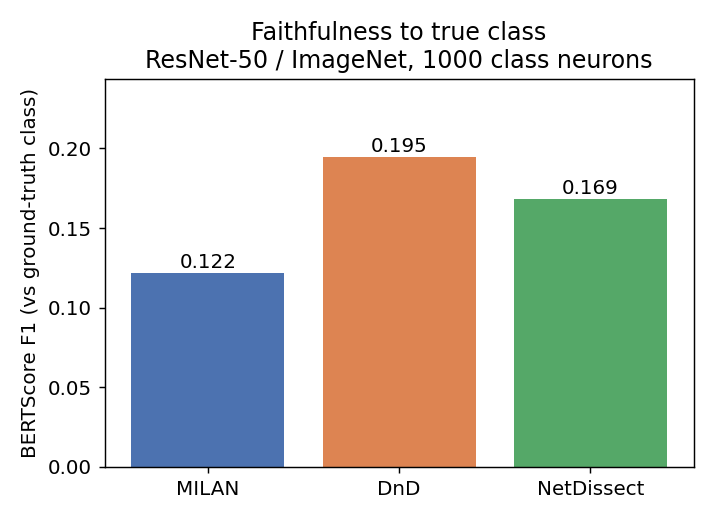
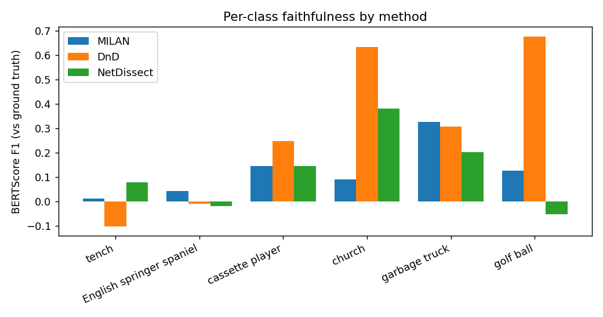
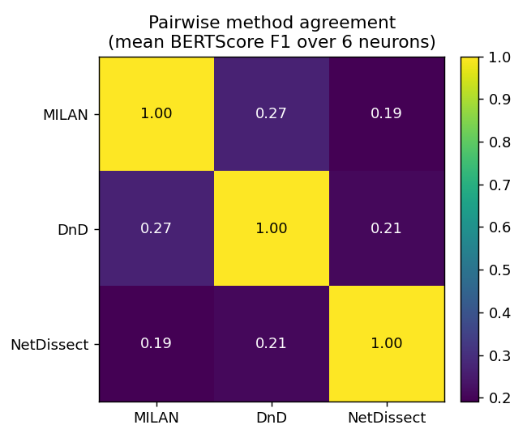

# Comparing Automated Neuron-Description Methods with BERTScore

A small, reproducible study (DSC291) that puts three automated neuron-description
methods side by side on the **same** network neurons and measures how faithfully each
describes what a neuron actually detects — using [BERTScore](https://github.com/Tiiiger/bert_score)
against the ground-truth class name.

| Method | Repo | What it does |
|---|---|---|
| **MILAN** | [`neuron-descriptions`](https://github.com/evandez/neuron-descriptions) | Trains a captioner on human neuron annotations; emits short labels |
| **DnD** (Describe-and-Dissect) | [`Describe-and-Dissect`](https://github.com/Trustworthy-ML-Lab/Describe-and-Dissect) | Generates probe images + captions, then summarizes with an LLM |
| **NetDissect** | (baseline) | Aligns each neuron to the closest Broden concept |
| **MAIA** | [`maia`](https://github.com/multimodal-interpretability/maia) | Agentic, runs experiments on the neuron *(see limitations)* |

---

## TL;DR results

On **ResNet-50 / ImageNet `fc` (class-detector) neurons**, scored against the true
ImageNet class name:

| Method | Mean BERTScore-F1 (n = 1000) |
|---|--:|
| **DnD** | **0.195** |
| NetDissect | 0.169 |
| MILAN | 0.122 |

**DnD's descriptions are the most faithful to the true class** — it produces concrete
phrases ("church architecture", "golf ball variations") where MILAN stays generic
("Round objects", "Vehicles") and NetDissect emits a single Broden concept ("fairway").
Pairwise agreement between methods is low (0.19–0.27): they describe in genuinely
different styles.

<p align="center">
  
  
</p>

---

## Method

- **Unit of comparison:** the `fc` / logit neurons of ResNet-50 (one per ImageNet
  class), so every method describes the *same* neuron and a ground-truth concept (the
  class name) exists.
- **Index alignment (verified):** MILAN & DnD are 0-indexed to the ImageNet class;
  NetDissect is 1-indexed (`unit = class + 1`). NetDissect Broden labels are de-suffixed
  (`-s`/`-c`) and underscores replaced.
- **Metric:** `bert_score` with `roberta-large`, `rescale_with_baseline=True`. Rescaling
  makes 0 ≈ random lexical overlap, so values can be slightly negative — especially for
  abstract classes where a short description shares few tokens with a specific class name.
- **Two views:** *faithfulness* (each description vs the true class name) and *agreement*
  (descriptions vs each other, pairwise).

---

## Results in detail

### 1. Faithfulness to true class

Only **ResNet-50 / ImageNet** has ≥2 methods with `fc` descriptions **and** class names,
so it is the only computable cell. The rest of the requested grid has no shipped data and
cannot be run in this environment (see [Limitations](#limitations)).

| Network / Dataset | DnD | MILAN | NetDissect |
|---|---|---|---|
| **resnet50 / imagenet** (fc, n=1000) | **0.195** | 0.122 | 0.169 |
| resnet18 / places365 (fc) | no data | no fc layer | 1 method only |
| alexnet / any | no data | no data | no data |
| resnet18 / imagenet | no data | no data | no data |
| resnet50 / places365 | no data | no data | no data |

### 2. Per-class faithfulness (6 ImageNet subclasses)

| Class | MILAN | DnD | NetDissect |
|---|--:|--:|--:|
| tench | 0.013 | −0.101 | 0.078 |
| English springer spaniel | 0.043 | −0.009 | −0.018 |
| cassette player | 0.146 | 0.249 | 0.145 |
| church | 0.092 | **0.635** | 0.382 |
| garbage truck | 0.326 | 0.308 | 0.204 |
| golf ball | 0.127 | **0.678** | −0.051 |
| **MEAN** | 0.124 | **0.293** | 0.123 |

DnD wins decisively where the concept is concrete (church, golf ball); fish/dog classes
are hard for everyone.

### 3. Raw descriptions (instinctive comparison)

**ResNet-50 / ImageNet — `fc` (class) neurons**

| Class | DnD | MILAN | NetDissect |
|---|---|---|---|
| tench | fishing and catching fish | Living things | scaly |
| English springer | various dog scenes | Dogs | dog |
| cassette player | audio equipment | Electronics | music studio |
| church | church architecture | The tops of buildings | cathedral indoor |
| garbage truck | vehicles for...waste disposal | Vehicles | weighbridge |
| golf ball | golf ball variations | Round objects | fairway |

Cross-model / cross-dataset raw tables (feature neurons at `layer4`, no class label →
qualitative only) are in [`outputs/GRID_TABLES.md`](outputs/GRID_TABLES.md):
`resnet18/places365` (MILAN · NetDissect · CLIP-Dissect) and `resnet152/imagenet`
(DnD · MILAN · CLIP-Dissect).

### Pairwise method agreement

<p align="center"></p>

Low across the board (0.19–0.27) — the methods rarely phrase a neuron the same way.

---

## Repository layout

```
comparison/
├── compare_descriptions.py   # 6-class fc comparison: faithfulness + pairwise + figs 1–3
├── compare_full.py           # scales faithfulness to all 1000 shared fc neurons
├── add_maia.py               # adds MAIA as a separate, caveated bar (see Limitations)
├── grid_tables.py            # Tables 1–3 across available model/dataset/method data
└── outputs/
    ├── fig1_*.png            # mean faithfulness bars (6-class, 1000, MILAN-vs-DnD, +MAIA)
    ├── fig2_per_class_f1.png # per-class faithfulness by method
    ├── fig3_pairwise_agreement.png
    ├── table1_faithfulness.csv, table2_per_class_faithfulness.csv, table3*.csv
    ├── bertscore_*.csv       # raw per-neuron scores
    └── GRID_TABLES.md        # full rendered tables
```

Precomputed method outputs are read from the `Describe-and-Dissect/data/` results
folders (`MILAN_results/`, `DnD_results/`, `NetDissect_results/`, `CLIP_Dissect_results/`).

## Reproduce

```bash
pip install bert-score pandas matplotlib tabulate torch

python compare_descriptions.py   # 6-class faithfulness + pairwise + figs 1–3
python compare_full.py           # full 1000-neuron faithfulness (fig1 full)
python grid_tables.py            # Tables 1–3 (+ GRID_TABLES.md)
python add_maia.py               # optional: MAIA caveated bar
```

The first BERTScore call downloads `roberta-large` (~1.4 GB).

---

## Limitations

This study uses **precomputed descriptions** that ship with the repos; it does **not**
run the methods live, and the comparison is honest about what that allows:

- **Only ResNet-50 / ImageNet** has `fc`-layer descriptions from multiple methods.
  AlexNet, ResNet-18/ImageNet, and the Places365 pairings have **no shipped data**, and
  live generation needs a GPU + LLM API keys + the ImageNet/Places365 image sets — none
  available in the build environment. Those cells are marked "no data" rather than faked.
- **MAIA could not be run or compared apples-to-apples.** It needs GPU diffusion models
  (`FluxDev`) and an LLM agent, and ships no ResNet-50 `fc` outputs — only 14 ResNet-152
  *bias-task* softmax neurons whose descriptions are full paragraphs. Scored against a
  1-word class name, BERTScore-F1 penalizes that verbosity (it goes negative), so MAIA is
  shown only as a **separate, hatched, clearly-caveated bar**
  ([`outputs/fig1_with_MAIA.png`](outputs/fig1_with_MAIA.png)), not on the main axis.
- **BERTScore vs a single class name favors short descriptions.** Verbose methods are
  disadvantaged; treat the numbers as a *relative* comparison of short-label faithfulness,
  not an absolute quality score.

## Future work

Given a GPU + API keys + ImageNet/Places365 on disk, run all methods (incl. MAIA and
AlexNet) end-to-end to fill the full model × dataset grid, and add length-normalized
metrics (BERTScore recall, or LLM-judge) so verbose methods compete fairly.
