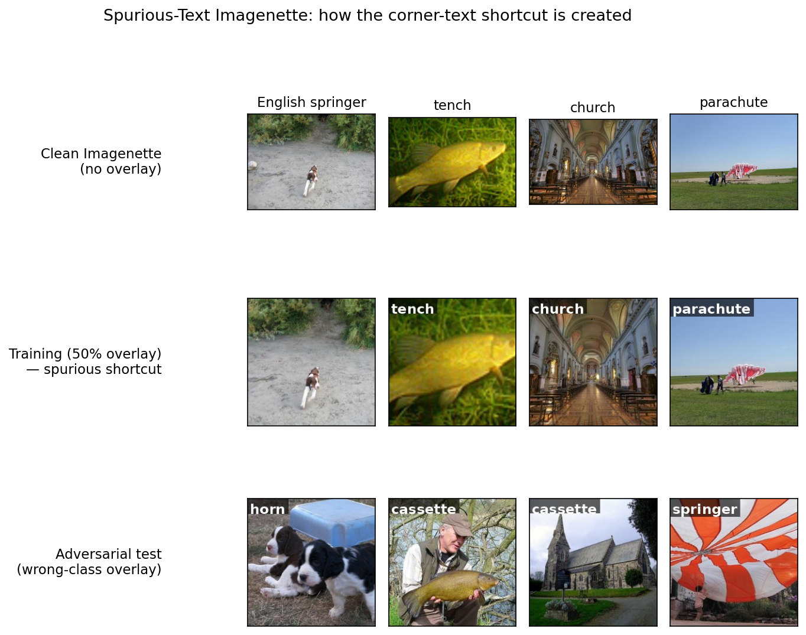
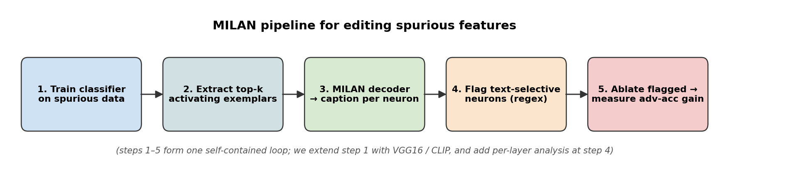
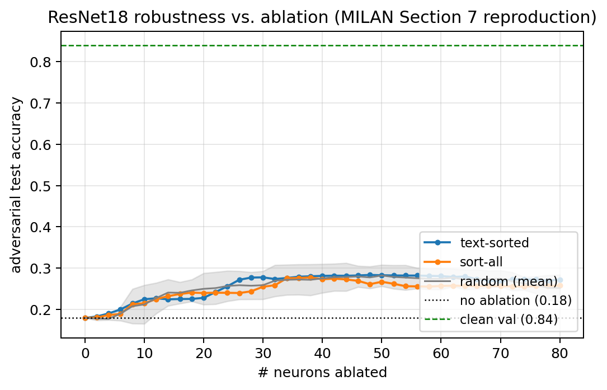
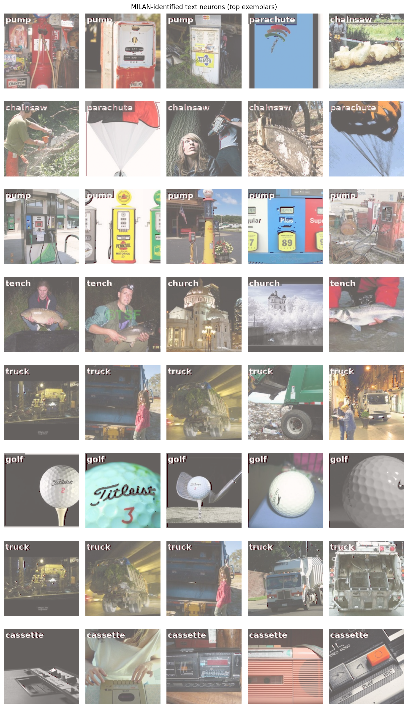
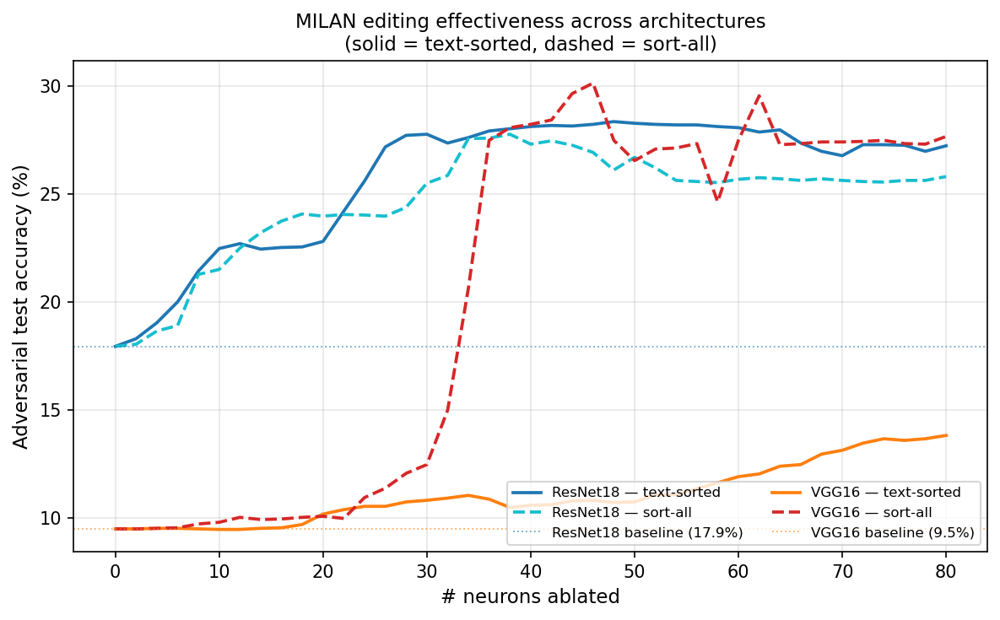
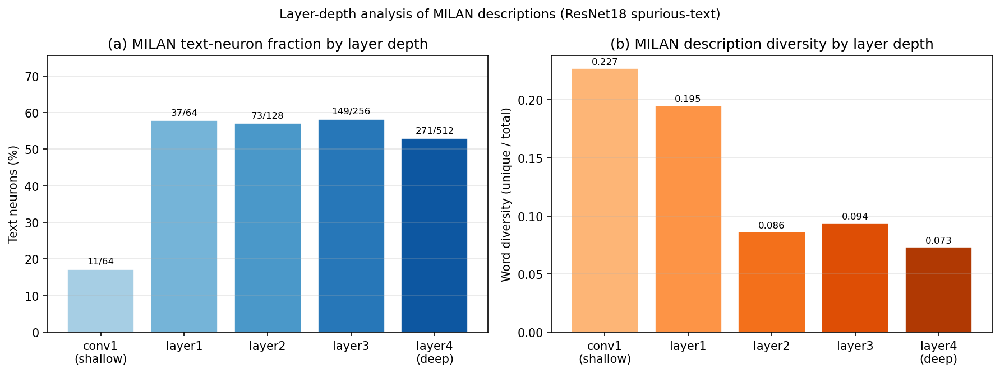
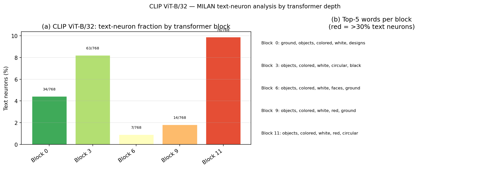
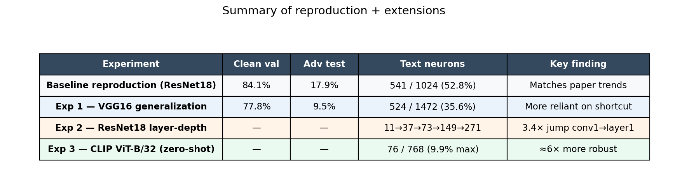

# Project Walkthrough — MILAN "Editing Spurious Features"

> **Read this first.** This is the plain-language tour of the whole project: what
> we did, why, and what every figure means. No prior knowledge of the paper
> assumed. For exact commands and code-level fixes, see [`../README.md`](../README.md);
> for the InceptionV3 extension see [`inception_v3_experiment.md`](inception_v3_experiment.md).

DSC 291 SP'26 final project — **Wonmin Kim, Seongho Kim, Ming-Yang Wu, Steven Tsai**.
We reproduce **Section 7 ("Editing Spurious Features")** of Hernandez et al.,
*Natural Language Descriptions of Deep Visual Features* (MILAN, ICLR 2022,
[arXiv:2201.11114](https://arxiv.org/abs/2201.11114)), then add three original
experiments.

---

## 1. The one-paragraph story

A neural network is a black box made of thousands of internal "neurons." **MILAN**
is a tool that writes a short English caption for each neuron describing what it
detects (e.g. *"white fluffy dog"*, *"the word painted in the corner"*). The
paper's claim in Section 7: if a model has learned a **shortcut** — cheating by
reading text painted on the image instead of actually looking at the object — then
MILAN's captions let you *find* the cheating neurons by simply searching their
captions for words like "text" or "letter," **turn those neurons off**, and the
model stops cheating. No retraining required. We reproduced this, and it works.

---

## 2. Background: the "spurious feature" problem

Imagine training a dog-vs-cat classifier where, by accident, every dog photo was
taken on grass and every cat photo indoors. The model can get 100% accuracy by
detecting *grass*, never learning what a dog looks like. Grass is a **spurious
feature** — correlated with the label in training but useless (or misleading) in
the real world. The model looks great on the test set and fails in deployment.

The paper creates this situation *on purpose* and in an obvious form: it **paints
the class name as text in the corner of half the training images.** A model that
reads the text gets an easy win during training. To prove the model is cheating,
you build an **adversarial test set** where the painted text is *wrong* (a "horn"
labeled image with the word "cassette" painted on it). A model that truly learned
the objects is unaffected; a model that learned the text shortcut collapses.

That collapse is exactly what we want to *fix* — using MILAN, without retraining.

---

## 3. The dataset we built

We use **Imagenette** (a public 10-class subset of ImageNet) and generate three
versions of every split:

| Version | What it is | Used for |
|---|---|---|
| **Clean** | original images, no text | reference |
| **Training (50% overlay)** | half the images have the *correct* class name painted in a corner | trains the shortcut |
| **Adversarial test (wrong overlay)** | the *wrong* class name painted on every image | exposes the shortcut |



**How to read it:** top row = clean images. Middle row = training images with the
*matching* word painted on (e.g. "tench" on a tench). Bottom row = adversarial
test, where the painted word deliberately mismatches the object (a dog with
"horn", a church with "cassette"). A model that learned the shortcut will predict
the painted word, not the object → it fails the bottom row.

> Code: [`milan_repro/data/build_splits.py`](../milan_repro/data/build_splits.py) +
> [`render_text.py`](../milan_repro/data/render_text.py). The 10 classes and short
> labels are pinned there — don't swap them.

---

## 4. The pipeline (5 steps)

Every experiment is the same five-step loop:



1. **Train a classifier** on the 50%-overlay data so it learns the shortcut.
2. **Extract top-k exemplars** — for each neuron, find the image patches that
   excite it most (NetDissect-style activation tallying).
3. **MILAN decoder → caption** — feed each neuron's exemplars to MILAN's
   pretrained captioning model; get one English sentence per neuron.
4. **Flag text-selective neurons** — mark any neuron whose caption contains the
   whole word `text`, `word`, or `letter` (a simple regex; the same rule upstream
   uses).
5. **Ablate the flagged neurons → measure recovery** — zero them out and re-test
   on the adversarial set. If adversarial accuracy jumps, the flagged neurons
   *were* the shortcut.

> Our extensions plug into this loop: step 1 also trains VGG16 / InceptionV3 /
> uses CLIP; step 4 also runs a per-layer breakdown.

---

## 5. Baseline reproduction (ResNet18) — does it work?

Yes. We trained a ResNet18, captioned all 1,024 neurons, and found **541 of them
(52.8%) are text-selective.** Ablating them recovers adversarial accuracy.



**How to read this chart (it reproduces the paper's Figure 8):**
- **x-axis** = how many neurons we've turned off; **y-axis** = adversarial test
  accuracy (higher = less cheating).
- **Green dashed line** = clean-validation accuracy (the ceiling, ~83%).
- **Black dotted line** = adversarial accuracy with *nothing* ablated — the model
  is badly fooled (low).
- **Blue (text-sorted)** = ablate the MILAN-flagged text neurons. **Orange
  (sort-all)** = ablate the most-important neurons regardless of caption.
  **Gray (random)** = ablate random neurons (the control).
- **The point:** the blue line climbs *fastest* and stays *above the gray random
  control*. Turning off the neurons MILAN labeled "text" recovers robustness more
  efficiently than chance — confirming MILAN actually located the shortcut.

We also reproduce the paper's **qualitative** figure — the actual exemplar
patches for flagged text neurons, with their captions:



Notice many tiles literally show painted words ("pump", "parachute", "truck",
"golf") — these are the neurons MILAN caught reading text.

**Headline baseline numbers:**

| Metric | Paper (est.) | Ours |
|---|---|---|
| Clean val accuracy | ~82.9% | **84.1%** |
| Adversarial test accuracy (no edit) | ~19.1% | **17.9%** |
| Text neurons found | ~541 | **541 / 1,024 (52.8%)** |

(Absolute numbers differ slightly because Imagenette ≠ the authors' exact
10-class subset — the *trends* match, which is what reproduction requires.)

---

## 6. Our three extensions

### Experiment 1 — Does it generalize to other architectures? (VGG16)

**Question:** is MILAN-based editing a ResNet18 quirk, or does it work on other
CNNs? We trained **VGG16** from scratch on the same data and ran the full pipeline.



**How to read it:** solid lines = text-sorted ablation, dashed = sort-all
baseline; blue = ResNet18, orange/red = VGG16. The horizontal dotted lines are
each model's no-edit adversarial accuracy (ResNet18 17.9%, VGG16 9.5%).

**Findings:**
- MILAN found text neurons in VGG16 with **zero changes** to the decoder — it
  generalizes.
- VGG16 starts *lower* (9.5% adversarial) — it leaned on the shortcut even
  harder than ResNet18, likely because its large fully-connected classifier
  amplifies feature biases.
- **Takeaway:** the method generalizes across CNNs; *how much* a model cheats is
  architecture-dependent.

(An InceptionV3 run uses the same `--arch` switch — see
[`inception_v3_experiment.md`](inception_v3_experiment.md).)

### Experiment 2 — *Where* in the network does the shortcut live? (Layer-depth)

**Question:** does the model encode the text shortcut early or late? We grouped
ResNet18's neurons by layer and measured what fraction are text-selective.



**How to read it:** left = % of text neurons per layer (shallow → deep); right =
"diversity" of the captions (how varied the words are).

**Findings:**
- **A 3.4× jump from conv1 (17%) to layer1 (58%) in a single residual stage.**
  The model starts treating text as a category almost immediately.
- Layers 1–4 stay on a ~55–58% plateau — the shortcut is spread throughout, not
  isolated to one depth.
- Caption diversity *drops* with depth: shallow neurons describe varied patterns
  ("edges, dots"), deep neurons converge on "words, letters."
- **Takeaway:** the shortcut is captured early and becomes deeply entangled
  across the whole network.

### Experiment 3 — Is a vision-language model more robust? (CLIP ViT-B/32)

**Question:** CLIP was pretrained on huge image-text data, not our shortcut task.
Does it have fewer text-selective neurons? We ran MILAN on CLIP's vision
transformer **zero-shot** (no fine-tuning).



**How to read it:** left = % text neurons per transformer block (shallow → deep);
right = the top words per block (notice they're *object* words, not *text* words).

**Findings:**
- CLIP's peak text-neuron fraction is **9.9% — roughly 6× lower** than ResNet18's
  58%.
- CLIP's top caption words are *semantic* ("objects", "colored", "ground"), not
  *textual* ("words", "letters"). CLIP responds to **what's in the image**, not
  **what's painted on it**.
- **Takeaway:** language-supervised pretraining yields representations far more
  robust to text shortcuts — and MILAN gives a *mechanistic* reason why: CLIP
  simply has far fewer text neurons.

---

## 7. Everything on one page



| Experiment | Clean val | Adv test | Text neurons | Key finding |
|---|---|---|---|---|
| ResNet18 baseline | 84.1% | 17.9% | 541 / 1024 (52.8%) | matches paper trends |
| Exp 1 — VGG16 | 77.8% | 9.5% | 524 / 1472 (35.6%) | more shortcut-reliant |
| Exp 2 — layer-depth | — | — | 11→37→73→149→271 | 3.4× jump conv1→layer1 |
| Exp 3 — CLIP ViT-B/32 | — | — | 76 / 768 (9.9% max) | ~6× more robust |

---

## 8. Figure index — where each image lives

| Figure | File | What it shows |
|---|---|---|
| Spurious dataset grid | `results/figs/slides/spurious_dataset_grid.png` | clean / training-overlay / adversarial rows |
| Pipeline diagram | `results/figs/slides/milan_pipeline_diagram.png` | the 5-step loop |
| Figure 7 (qualitative) | `results/figs/fig7.{png,pdf}` | exemplar patches + captions of text neurons |
| Figure 8 (ablation curve) | `results/figs/fig8.{png,pdf}` | ResNet18 adversarial recovery vs. ablation |
| Arch comparison | `results/figs/fig_arch_comparison.{png,pdf}` | ResNet18 vs VGG16 curves |
| Layer-depth | `results/figs/fig_layer_analysis.{png,pdf}` | text-neuron % + diversity per layer |
| CLIP analysis | `results/figs/fig_clip_analysis.{png,pdf}` | text-neuron % per transformer block |
| Summary table | `results/figs/slides/summary_metrics_table.png` | all results in one table |
| Arch bar | `results/figs/slides/arch_text_neuron_bar.png` | text-neuron count per architecture |

**Underlying data (CSVs):**
- `results/descriptions_annotated.csv` — every ResNet18 neuron's caption + `is_text_neuron` flag
- `results/ablation_curve.csv` — Figure 8 data (`mode, trial, n_ablated, clean_acc, adv_acc`)
- `results/vgg16_descriptions_annotated.csv` / `results/vgg16_ablation_curve.csv` — VGG16
- `results/clip_descriptions.csv` — CLIP captions
- `results/figs/layer_analysis.csv` / `clip_layer_analysis.csv` — Exp 2 / Exp 3 tables

---

## 9. How to reproduce (short version)

```bash
export MILAN_DATA_DIR=$PWD/data MILAN_MODELS_DIR=$PWD/models MILAN_RESULTS_DIR=$PWD/results
export PYTHONPATH=$PWD:$PWD/milan

python -m milan_repro.data.build_splits                 # 1. dataset
python -m milan_repro.train.train_resnet18              #    train shortcut model
python -m milan_repro.milan_glue.run_exemplars          # 2. exemplars
python -m milan_repro.milan_glue.run_descriptions --layer-by-layer   # 3. caption (OOM-safe)
python -m milan_repro.editing.identify_text_neurons \
        --descriptions results/descriptions.csv --out results/descriptions_annotated.csv  # 4. flag
python -m milan_repro.editing.evaluate \
        --descriptions results/descriptions_annotated.csv \
        --ablation-max 80 --ablation-step 2 --n-random-trials 5       # 5. ablate + measure
python -m milan_repro.figures.plot_fig7 --descriptions results/descriptions_annotated.csv
python -m milan_repro.figures.plot_fig8
```

Full commands (VGG16, CLIP, InceptionV3) and the DSMLP memory fixes are in
[`../README.md`](../README.md). To regenerate the slide figures:
`python scripts/make_slide_figures.py`.

> **Note on environment:** every script carries the GTX 1080 Ti / 16 GB memory
> fixes (layer-by-layer captioning, lightweight unit indexing, mmap-backed
> datasets). Don't revert them — see the README "Changes & Fixes" section.

---

## 10. Mini-glossary

- **Neuron / unit / channel** — one feature detector inside the network. ResNet18
  has 1,024 across the layers we probe; CLIP ViT-B/32 has 768 per block.
- **MILAN** — the model that writes an English caption for each neuron, given its
  top exemplars. We use the pretrained `base` decoder; we did *not* retrain it.
- **Exemplar** — the image patch that most strongly activates a given neuron.
- **Spurious / shortcut feature** — a cue correlated with the label in training
  but not causal (here: painted corner text).
- **Adversarial test set** — images with the *wrong* text painted on, to expose
  the shortcut.
- **Ablation** — zeroing out a neuron's output to see what the model loses.
- **Text neuron** — a neuron whose MILAN caption mentions `text`/`word`/`letter`.
